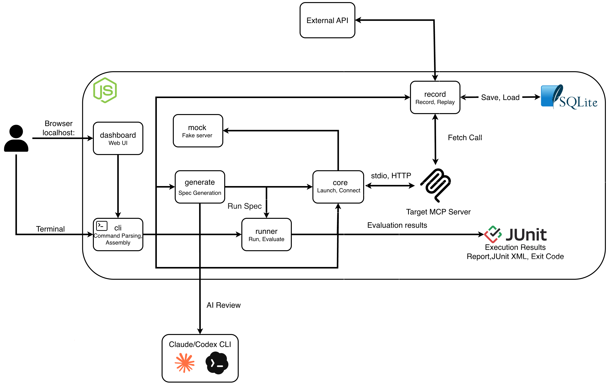

<h1 align="center">MCPeak</h1>

<p align="center"><b>MCP 서버를 코드로 자동 테스트하는 프레임워크</b><br>
서버를 띄우고, 응답을 검증하고, 외부 호출을 녹화해 재생하고, 목 서버로 대체하는 일을 명령 하나로 한다.</p>

<p align="center">
  <a href="https://www.npmjs.com/package/@mcpeak/cli"></a>
  <a href="./LICENSE"></a>
  
  <a href="https://github.com/2026-Engineering-Contest/MCPeak/actions/workflows/ci.yml"></a>
</p>

```bash
npm install -g @mcpeak/cli
mcpeak test weather.suite.json -- node ./server.js
```

<p align="center">
  <a href="https://2026-engineering-contest.github.io/MCPeak/ko/"><b>가이드 사이트 (한국어)</b></a> ·
  <a href="https://2026-engineering-contest.github.io/MCPeak/">English docs</a> ·
  <a href="https://2026-engineering-contest.github.io/MCPeak/ko/quick-start">빠른 시작</a> ·
  <a href="https://2026-engineering-contest.github.io/MCPeak/ko/reference/cli">CLI 레퍼런스</a> ·
  <a href="https://2026-engineering-contest.github.io/MCPeak/ko/faq">FAQ</a>
</p>

MCP(Model Context Protocol) 서버는 LLM 클라이언트에 붙여 손으로 눌러 봐야 동작을 알 수 있었다.
MCPeak 은 그 확인을 JSON 명세와 터미널 명령으로 바꾼다. 테스트가 실패하면 어느 단언이 무엇과
왜 다른지, 어떻게 고치는지를 한 줄로 찍는다. 서버가 `globalThis.fetch` 로 밖에 부르는 HTTP 호출은
한 번 녹화해 두고 이후에는 재생하므로 같은 입력에 같은 결과가 나온다. 서버 코드가 아직 없어도
목 정의 파일 하나로 설계를 먼저 검증할 수 있다.

## 시작하기

하고 싶은 일에 따라 들어가는 곳이 다르다.

| 하고 싶은 일 | 명령 | 가이드 |
|---|---|---|
| 명세를 쓰고 서버를 테스트한다 | `mcpeak test suite.json -- node ./server.js` | [명세 작성](https://2026-engineering-contest.github.io/MCPeak/ko/guide/writing-suites) |
| 서버 스키마에서 명세를 만든다 | `mcpeak generate --out suite.json -- node ./server.js` | [명세 생성](https://2026-engineering-contest.github.io/MCPeak/ko/guide/generate) |
| 서버 없이 목으로 테스트한다 | `mcpeak test suite.json --command mcpeak-mock --arg mock.json` | [목 서버](https://2026-engineering-contest.github.io/MCPeak/ko/guide/mock-server) |
| 외부 API 호출을 녹화하고 재생한다 | `mcpeak test suite.json --record-session s.db -- node ./server.js` | [External 세션](https://2026-engineering-contest.github.io/MCPeak/ko/guide/external-sessions) |
| 실패한 케이스를 AI 로 고친다 | `mcpeak repair bundle.json --provider claude --model <model>` | [Repair](https://2026-engineering-contest.github.io/MCPeak/ko/guide/repair) |
| 웹 UI 에서 돌린다 | `mcpeak-dashboard` | [대시보드](https://2026-engineering-contest.github.io/MCPeak/ko/guide/dashboard) |
| CI 에 붙인다 | `mcpeak test suite.json --junit out.xml -- node ./server.js` | [CI 연동](https://2026-engineering-contest.github.io/MCPeak/ko/guide/ci) |

## 설치

```bash
npm install -g @mcpeak/cli
```

설치하면 `mcpeak` 명령이 `PATH` 에 놓인다. 한 번만 쓸 거라면 `npx @mcpeak/cli test ...` 로
설치 없이 실행해도 된다. Node 22.18 이상이 필요하다.

목 서버와 웹 UI 는 별도 패키지다. 전역 설치는 그 패키지 자신의 실행 파일만 `PATH` 에 놓으므로
`mcpeak-mock` 과 `mcpeak-dashboard` 를 쓰려면 따로 설치해야 한다.

```bash
npm install -g @mcpeak/cli @mcpeak/mock @mcpeak/dashboard
```

## 첫 테스트

테스트할 것을 JSON 명세로 적는다.

```json
{
  "schemaVersion": 1,
  "id": "weather",
  "name": "날씨 서버",
  "cases": [
    {
      "id": "tool-exists",
      "name": "get_weather 도구를 제공한다",
      "operation": { "type": "listTools" },
      "assertions": [{ "type": "toolExists", "tool": "get_weather" }]
    },
    {
      "id": "seoul-succeeds",
      "name": "서울 날씨를 정상 조회한다",
      "operation": { "type": "callTool", "tool": "get_weather", "input": { "city": "서울" } },
      "assertions": [{ "type": "isError", "expected": false }]
    }
  ]
}
```

서버를 띄우는 명령과 함께 넘긴다. `--` 뒤가 전부 서버 실행 명령이다.

```bash
mcpeak test weather.suite.json -- node examples/weather-server/server.mjs
```

```
날씨 서버  (2 cases)

✓ tool-exists     get_weather 도구를 제공한다
✓ seoul-succeeds  서울 날씨를 정상 조회한다

2 passed  (2 total)
```

예제 서버는 이 저장소의 `examples/weather-server/` 에 있다. npm 으로만 설치해서 붙일 서버가
없다면 목 서버로 시작하면 된다. 위 명세를 그대로 두고 목 정의 JSON 하나만 더 만들면 같은 두
케이스가 통과한다.

## 실패했을 때

케이스가 실패하면 어느 단언이 무엇과 왜 다른지, 그리고 어떻게 고치는지가 나온다.

```
✗ missing-tool  존재하지 않는 도구를 요구한다
    toolExists  툴 'missing_weather_tool'을(를) 찾을 수 없습니다. 발견된 툴: 'add', 'get_weather'
    해결: 서버의 tools/list 응답과 테스트 명세를 확인하세요.

1 failed  (1 total)
```

명세를 못 읽거나 서버에 못 붙는 등 실행 자체가 실패하면 원인 코드와 해결 방법이 나온다.

```
오류 [MCP_CONNECTION_FAILED/PROCESS_START_FAILED]: MCP 서버 프로세스를 시작하지 못했습니다.
해결: command 실행 가능 여부와 cwd를 확인하세요.
```

둘 다 종료 코드는 1 이다. 출력 형식 전체는
[CLI 레퍼런스](https://2026-engineering-contest.github.io/MCPeak/ko/reference/cli)에 있다.

## 어떻게 다른가

세 가지를 기준으로 만든다.

- 실패 메시지가 곧 제품이다. `expected true, got false` 대신 무엇이 왜 다른지, 어떻게 고치는지를
  출력한다.
- 같은 입력에 같은 결과가 나온다. 서버가 `globalThis.fetch` 로 밖에 부르는 호출은 한 번 녹화해
  재생하고, 목 서버의 응답은 사람이 지정한 값이라 언제나 같은 바이트를 돌려준다. `node:http` 나
  axios 처럼 `fetch` 를 거치지 않는 호출은 녹화 범위 밖이라 실제로 나간다. `--determinism` 을
  붙이면 같은 명세를 두 번 돌려 결과를 비교한다. 이 비교는 판정을 막지 않는 진단이라 차이가
  있어도 종료 코드는 그대로이고, `--reset-cmd` 로 실행 사이에 상태를 복원해야 결정론성 확인으로
  친다.
- 명세를 손으로 다 쓰지 않아도 된다. 서버의 툴 스키마를 읽어 정상 케이스와 위반 케이스를
  결정론적으로 합성하고, 사람이 승인한 명세에만 지문을 찍는다.

동작 원리는 [가이드 사이트의 개념 문서](https://2026-engineering-contest.github.io/MCPeak/ko/concepts/how-it-works)에,
"다르게 갈 수도 있었던" 판단은 [`docs/adr/`](./docs/adr)에 한 페이지씩 남겨 둔다.

## 구조

<p align="center"></p>

사용자는 터미널에서 `cli` 를, 브라우저에서 `dashboard` 를 쓴다. `cli` 는 `generate` 로 명세를
만들고 `runner` 로 실행하며, `runner` 는 `core` 를 거쳐 대상 MCP 서버에 stdio 나 HTTP 로 붙는다.
`record` 는 서버가 밖으로 부르는 `fetch` 호출을 SQLite 파일에 저장했다가 재생하고, `mock` 은
대상 서버 자리를 대신한다. `generate` 의 AI 검토는 로컬에 설치된 Claude 나 Codex CLI 로 나간다.
결과는 터미널 리포트, JUnit XML, 종료 코드로 나온다.

## 패키지

| 패키지 | 역할 |
|---|---|
| [`@mcpeak/cli`](./packages/cli) | CLI 진입점. 얇게 유지한다 |
| [`@mcpeak/core`](./packages/core) | MCP 프로토콜 클라이언트, 트랜스포트, 프로세스 수명주기 |
| [`@mcpeak/runner`](./packages/runner) | 선언형 테스트 실행, assertion, 구조화된 리포트 |
| [`@mcpeak/generate`](./packages/generate) | 결정론적 baseline 과 승인형 AI 검토로 테스트 생성 |
| [`@mcpeak/record`](./packages/record) | 녹화, 재생, 계약 스냅샷 |
| [`@mcpeak/mock`](./packages/mock) | 목 MCP 서버(Streamable HTTP, stdio), 응답 주입 |
| [`@mcpeak/dashboard`](./packages/dashboard) | 로컬 웹 UI. `mcpeak-dashboard` 로 띄운다 |

의존 방향은 단방향이다: `dashboard` → `cli` → `runner`/`generate`/`record`/`mock` → `core`.
오른쪽에 있는 하위 계층으로만 의존할 수 있다는 뜻이며, 인접 계층을 건너뛰어도 된다
([ADR-0091](./docs/adr/0091-패키지는-하위-계층을-직접-의존할-수-있다.md)).

## 개발

```bash
corepack enable       # pnpm 활성화 (packageManager 핀 사용)
pnpm install
pnpm build            # 7개 패키지 + 예제 서버 dist/ 생성
pnpm typecheck
pnpm test
pnpm lint
```

저장소에서 작업할 때는 설치본 대신 빌드 산출물을 부른다. 고친 코드가 바로 반영된다.

```bash
node packages/cli/dist/cli.mjs test <suite.json> -- node ./server.js
```

`pnpm build` 를 건너뛰면 낡은 `dist/` 를 문다. 소스를 고쳤으면 다시 빌드한다. CI 는 최소 버전인
Node 22.18.0 과 Node 24 에서 검사한다.

가이드 사이트의 원고는 `website/` 에 있고, main 에 푸시되면 GitHub Pages 로 배포된다.
처음 기여한다면 [기여 안내](./.github/CONTRIBUTING.md)를 본다. 팀 내부 규칙은 [CONTRIBUTING.md](./CONTRIBUTING.md)에 있다.

## 라이선스

[MIT](./LICENSE)
