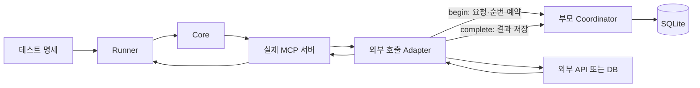
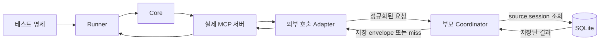
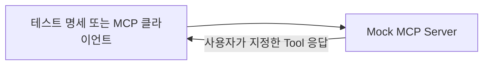

# Record/Replay 상위 설계

> 상태: 세부 결정 반영 초안
> 날짜: 2026-08-20 (2026-08-21 Coordinator·경계·HTTP 정책 반영)
> 기준: 「MCP 테스트 및 코드 최적화 도구 구상」의 Session Recording / Replay 설계와 담당자 확인 내용
> 목적: 세부 ADR과 구현 계획을 작성하기 전에 제품의 책임과 실행 경계를 먼저 고정한다.
> 세부 결정 제안: [ADR-0051](./adr/0051-external-record-replay와-tool-카세트-경계-분리.md),
> [ADR-0052](./adr/0052-coordinator가-engine과-session-store를-소유한다.md),
> [ADR-0053](./adr/0053-http-외부-요청-매칭과-반복-호출-정책.md)

## 1. 한 문장

**Record/Replay는 실제 MCP 서버를 실행하되, 서버가 외부로 보내는 호출과 그 응답만 기록하거나 저장된 값으로 대체한다.**

Record/Replay가 MCP 서버 자체를 대신하지 않는다. 실제 MCP 서버를 대신하는 기능은 `mock`의
책임이다.

## 2. 목표

- 외부 API나 DB를 다시 호출하지 않고 빠르게 오프라인 테스트한다.
- 유료 API와 사용량 기반 서비스의 반복 호출 비용을 줄인다.
- 같은 외부 응답을 사용해 반복 가능한 테스트 환경을 만든다.
- MCP Tool 코드가 바뀌어도 같은 외부 응답을 공급해 코드 변경의 영향을 검증한다.
- 녹화할 때 사용한 테스트 명세와 다른 명세도, 필요한 외부 호출 기록이 있으면 재생할 수 있게 한다.

## 3. 책임 경계

| 기능 | 실제 MCP 서버 | 외부 의존성 | 저장 또는 대체하는 값 | 주 검증 대상 |
|---|---:|---|---|---|
| `record` | 실행함 | 실제로 호출함 | 외부 요청과 응답 | MCP 서버 코드와 실제 연동 |
| `replay` | 실행함 | 호출하지 않음 | 저장된 외부 응답을 반환 | 같은 외부 조건에서의 MCP 서버 코드 |
| `mock` | 실행하지 않음 | 없음 | 사용자가 지정한 MCP Tool 응답 | MCP 클라이언트와 MCP 계약 |

따라서 다음 둘은 서로 다른 기능이다.

- `replay`: 실제 서버 코드가 실행되고 외부 의존성만 저장값으로 바뀐다.
- `mock`: 실제 서버 대신 목 MCP 서버가 Tool 목록과 응답을 제공한다.

## 4. 실행 흐름

### 4.1 Record

1. CLI가 부모 프로세스에 Coordinator를 열고 Core가 실제 MCP 서버를 시작한다.
2. Runner가 테스트 명세를 실행한다.
3. MCP 서버가 외부 API 또는 DB를 호출하려 하면 Adapter가 요청을 정규화한다.
4. Adapter가 Coordinator에 interaction 자리를 예약한다. 예약에 실패하면 실제 외부 호출 전에
   중단한다.
5. Adapter가 실제 외부 호출을 수행한다.
6. 반환값 또는 예외를 저장 envelope로 encode해 Coordinator에 `complete`로 보낸다.
7. Coordinator가 저장 성공을 확인한 뒤에야 원래 반환값을 MCP 서버 코드에 원래 형태로
   전달하거나 원래 예외를 다시 던진다. `complete` 전송이나 세션 저장이 실패하면 그 외부 호출을
   실행 실패로 전파한다. 외부 호출은 성공했는데 기록이 남지 않은 결과를 성공으로 노출하지
   않는다. 자동 재시도나 우회는 하지 않는다.

### 4.2 Replay

1. 사용자가 source session을 명시하고, Record 때와 마찬가지로 Coordinator와 실제 MCP 서버를
   시작한다.
2. MCP 서버 코드가 실행되다가 외부 호출 지점에 도달하면 Adapter가 요청을 정규화한다.
3. Coordinator가 source session에서 `protocol + matchKey + occurrence`로 결과를 조회한다.
4. hit이면 Adapter가 저장 envelope를 네이티브 응답 또는 예외로 복원한다.
5. miss이면 실제 외부 호출을 수행하지 않고 재생 실패로 보고한다.

### 4.3 Mock

Mock은 실제 MCP 서버 코드와 외부 의존성을 모두 실행하지 않는다.

## 5. 기록 단위

Record가 저장하는 기본 단위는 MCP Tool 호출 결과가 아니라 **MCP 서버가 수행한 외부 호출**이다.

외부 호출 기록은 최소한 다음 정보를 가진다.

| 항목 | 의미 |
|---|---|
| 대상 | 어떤 외부 API 또는 DB 작업이었는가 |
| 시각 | 언제 호출되었는가 |
| 요청 | 어떤 요청을 보냈는가 |
| 결과 | 성공 응답인지 예외인지를 구분하는 outcome과 그 값 |

`결과`는 성공과 예외를 구분하는 discriminator를 반드시 포함한다. 구분이 없으면 Replay가 기록된
실패를 성공 응답으로 복원한다. 성공·예외 각각의 필수 필드는
[외부 호출 어댑터 확장 설계](./2026-08-21-record-replay-외부호출-어댑터-설계.md)의 저장 결과
계약을 규범으로 따른다.

물리적인 SQLite 테이블 구조와 프로토콜별 요청 스키마는 후속 설계에서 정한다.

## 6. 매칭 원칙

- 재생 매칭은 테스트 명세의 케이스 ID나 MCP Tool 이름을 기준으로 하지 않는다.
- MCP 서버가 실제로 내보내려 한 외부 요청을 기준으로 저장된 응답을 찾는다.
- HTTP와 DB는 요청 구조가 다르므로 프로토콜별 매칭 규칙을 가진다.
- HTTP 1차 매칭은 method, 보수적으로 정규화한 URL, 고정 헤더 allowlist, JSON body를 사용한다.
- 같은 HTTP 요청은 matchKey별 occurrence 순서로 소비하며, source session은 사용자가 명시한다.
- Replay miss는 실제 네트워크로 fallback하지 않는다.
- 정확한 HTTP v1 규칙과 미지원 범위는
  [ADR-0053](./adr/0053-http-외부-요청-매칭과-반복-호출-정책.md)을 따른다.
- SQL 정규화와 DB 반복 호출 정책은 첫 DB·드라이버를 고를 때 별도 ADR로 정한다.
- 녹화 때와 다른 테스트 명세라도 같은 외부 요청을 만들면 기존 기록을 사용할 수 있어야 한다.

## 7. 저장소와 관리

- 기본 저장소는 SQLite다.
- 기본 경로는 프로젝트 로컬의 `.mcp-test/sessions.db`다.
- 부모 Coordinator만 SQLite를 열고 세션과 외부 호출 기록을 관리한다.
- 자식 MCP 서버와 Adapter에는 DB 경로나 SQLite 구현을 전달하지 않는다.
- 1차 저장 구현은 Node `22.13.0` 이상의 내장 `node:sqlite`를 사용한다.
- 기존 세션 또는 캐시 데이터를 정리하는 CLI 명령을 제공한다.
- 사람이 검토하거나 CI에서 이동할 수 있는 JSON export/import가 필요한지는 후속 범위에서 정한다.
- SQLite와 JSON을 동시에 수정 가능한 원본으로 두지는 않는다.

## 8. 보안과 마스킹 원칙

- 인증 정보와 비밀값은 영속 저장소에 원문으로 남기지 않는다.
- 외부 요청을 매칭하는 데 필요한 정보와 사람이 볼 수 있는 저장 데이터의 경계를 분리한다.
- 요청 정규화와 마스킹은 원본 요청을 볼 수 있는 Adapter에서 수행하고, Coordinator에는 저장 가능한
  envelope만 보낸다.
- 요청과 응답은 저장 경계를 통과하기 전에 마스킹한다.
- Coordinator는 `127.0.0.1`의 임의 포트에만 열고 실행별 임시 token, payload 상한,
  fail-closed를 적용한다. token은 저장하거나 진단에 출력하지 않는다.

## 9. 현재 구현과의 차이

현재 `record` 구현은 `McpClient`를 감싸고 다음 값을 카세트에 저장한다.

- 매칭 키: MCP Tool 이름 + Tool 인자
- 기록 값: MCP Tool의 전체 `ToolResult`
- Replay: 실제 MCP 서버를 시작하지 않고 저장된 ToolResult를 Runner에 반환

이 구조는 이 문서의 상위 설계와 다르다. 목표 구조에서는 `McpClient` 바깥에서 ToolResult를
대체하지 않고, 실제 MCP 서버 안의 외부 호출 경계에서 요청과 응답을 기록하거나 재생한다.

기존 구현은 [ADR-0051](./adr/0051-external-record-replay와-tool-카세트-경계-분리.md)에 따라
legacy로 동결한다. 신규 External 구현은 기존 `Cassette`·`cassetteClient`·Tool 매칭 타입을
참조하지 않는다. 신규 수직 기능과 CLI 전환이 검증된 뒤에 기존 API를 유지·개명·제거할지를
마이그레이션 단계에서 확정한다. 공통화는 같은 의미가 검증된 순수 함수에만 허용한다.

`mock`은 이미 실제 MCP 서버를 대신하는 별도 기능이므로 책임을 그대로 유지한다.

## 10. 이 문서가 제안하는 것

다음은 이 문서가 상위 설계로 제안하는 항목이다. 7·9·10은 ADR-0051·ADR-0052가 채택되기 전까지
확정된 계약이 아니며, 구현의 선행 조건으로 쓰지 않는다.

1. Record와 Replay 모두 실제 MCP 서버를 실행한다.
2. Record는 실제 외부 호출의 요청과 응답을 기록한다.
3. Replay는 외부 호출만 저장된 응답으로 대체한다.
4. Record/Replay는 MCP Tool 전체 응답을 직접 대체하지 않는다.
5. Mock은 실제 MCP 서버를 대신하는 별도 기능이다.
6. Replay는 녹화 때와 다른 테스트 명세로도 실행할 수 있어야 한다.
7. 기본 저장소는 `.mcp-test/sessions.db`의 SQLite다.
8. 저장된 세션과 캐시를 정리하는 CLI 기능을 제공한다.
9. 부모 Coordinator가 Engine과 Session Store를 소유하고 자식에는 Adapter만 둔다.
10. 신규 External 구현과 기존 Tool 카세트는 타입·저장 형식·실행 경로를 공유하지 않는다.

## 11. 큰 원칙에서 따라오는 것

1. Replay 중에도 서버 코드 변경은 실행 결과에 반영된다.
2. 외부 호출을 관찰하고 대체할 수 있는 훅 또는 동등한 가로채기 계층이 필요하다.
3. 매칭 키의 입력은 MCP Tool 호출이 아니라 외부 요청이다.
4. 마스킹과 매칭에 필요한 정책은 외부 요청을 볼 수 있는 실행 경계까지 전달돼야 한다.
5. 기존의 서버 없는 Replay 경로와 ToolResult 카세트 구조는 새 설계에 그대로 사용할 수 없다.
6. 자식 Adapter와 부모 Coordinator 사이에 version이 있는 내부 통신 계약이 필요하다.

## 12. 아직 정하지 않는 것

다음 항목은 이 문서의 큰 방향을 바꾸지 않는 후속 결정이다.

- DB를 지원한다면 어떤 드라이버부터 지원할지
- Python·Go 등 다른 런타임의 가로채기 방식
- `node:http`, `node:https`, axios, node-fetch, undici의 후속 지원 순서
- HTTP binary·text·stream·multipart·redirect 지원 방식
- DB의 정확한 매칭 키 및 정규화 규칙
- 기록 시각을 참고 정보로만 쓸지, 만료 판단에도 쓸지
- SQLite의 최종 물리 스키마, 마이그레이션, 비정상 종료 복구 방식
- 신규 External 흐름 검증 뒤 기존 JSON 카세트를 유지·개명·제거할 최종 시점

## 13. 상위 인수 기준

### Record

- 실제 MCP 서버 프로세스가 실행된다.
- 테스트 명세가 서버의 실제 MCP Tool 코드를 호출한다.
- 지원 범위의 외부 호출은 실제로 수행된다.
- 부모 Coordinator가 외부 호출의 대상·시각·요청·응답을 SQLite에 저장한다.
- Coordinator가 interaction을 예약하지 못하면 실제 외부 호출 전에 실패한다.

### Replay

- 실제 MCP 서버 프로세스가 실행된다.
- 지원 범위의 외부 호출은 실제 네트워크나 DB로 나가지 않는다.
- 저장된 외부 응답이 서버 코드에 반환된다.
- 사용자가 Replay source session을 명시한다.
- 녹화 때와 다른 테스트 명세도 필요한 외부 호출 기록이 있으면 실행된다.
- 서버 코드를 바꾸면 같은 외부 응답을 사용하면서 변경된 코드의 결과를 검증할 수 있다.

### Mock

- 실제 MCP 서버가 없어도 목 MCP 서버의 Tool과 응답으로 클라이언트 동작을 검증할 수 있다.

### 저장소 관리

- `.mcp-test/sessions.db`에서 세션을 조회하고 재생할 수 있다.
- CLI 명령으로 기존 세션 또는 캐시 데이터를 정리할 수 있다.

## 14. 후속 문서

공통 확장 지점과 HTTP·DB 어댑터의 경계는
[Record/Replay 외부 호출 어댑터 확장 설계](./2026-08-21-record-replay-외부호출-어댑터-설계.md)에서
구체화한다. 현재 연결된 제안은 다음과 같다. 세 ADR이 채택되기 전에는 구현의 선행 조건으로
사용하지 않는다.

1. [ADR-0051](./adr/0051-external-record-replay와-tool-카세트-경계-분리.md): legacy와
   External 경계
2. [ADR-0052](./adr/0052-coordinator가-engine과-session-store를-소유한다.md): 부모
   Coordinator, 내부 통신, Node·SQLite 런타임
3. [ADR-0053](./adr/0053-http-외부-요청-매칭과-반복-호출-정책.md): HTTP 매칭,
   occurrence, strict miss, 1차 지원 범위

후속 문서는 이 결정 위에서 다음 순서로 작성한다.

1. 최소 `fetch` Record→Replay 수직 기능 구현 계획
2. SQLite 물리 스키마와 마이그레이션 계획
3. CLI session 옵션과 기존 API 마이그레이션 계획
4. HTTP H1·H2 E2E 검증 계획
5. 첫 DB·드라이버 선정 후 DB 어댑터 설계
