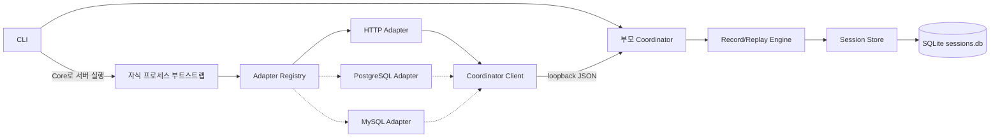

# Record/Replay 외부 호출 어댑터 확장 설계

> 상태: ADR 결정 반영 초안
> 날짜: 2026-08-21
> 상위 문서: [Record/Replay 상위 설계](./2026-08-20-record-replay-상위-설계.md)
> 목적: Node HTTP 1차 구현에 필요한 공통 확장 지점을 정하고, 후속 DB 어댑터가 HTTP 구현을
> 다시 뜯지 않고 들어올 자리를 마련한다.
> 결정:
> [ADR-0051](./adr/0051-external-record-replay와-tool-카세트-경계-분리.md),
> [ADR-0052](./adr/0052-coordinator가-engine과-session-store를-소유한다.md),
> [ADR-0053](./adr/0053-http-외부-요청-매칭과-반복-호출-정책.md)

## 1. 이번 문서의 범위

이번 문서는 다음 두 가지를 함께 다룬다.

1. **HTTP 1차 구현이 바로 사용할 최소 공통 구조**
2. **DB 설계를 후속으로 붙일 수 있는 확장 계약과 저장 공간**

아직 실제 코드를 구현하거나 공개 API를 확정하지 않는다. 아래 TypeScript는 패키지 간 공개 계약이
아니라 책임을 분리하기 위한 내부 계약 초안이다.

## 2. 설계 원칙

1. 공통 엔진은 HTTP의 `method`·`url`이나 DB의 `sql`·`parameters`를 직접 해석하지 않는다.
2. 프로토콜 어댑터가 네이티브 요청을 정규화하고, 저장된 결과를 네이티브 응답으로 복원한다.
3. 저장소는 프로토콜별 칼럼 대신 버전이 있는 JSON envelope를 보관한다.
4. 매칭 키는 Tool 이름이나 테스트 케이스가 아니라 정규화된 외부 요청에서 만든다.
5. Replay miss는 실제 외부 호출로 빠져나가지 않고 실패한다.
6. 어댑터 설치 방식과 기록·재생 엔진을 분리한다.
7. 공통 저장 envelope는 동기·비동기 호출을 모두 표현할 수 있게 두되, 1차 실행 계약은 실제로
   검증하는 비동기 `fetch`만 만든다. 동기 DB 호출의 IPC는 첫 드라이버 선정 뒤 별도 결정한다.
8. 새 프로토콜이나 드라이버 추가는 엔진의 분기문 수정이 아니라 어댑터 등록으로 끝나야 한다.
9. 부모 Coordinator가 Engine과 Session Store를 소유하고, 자식은 저장소를 직접 열지 않는다.
10. 신규 External 구현은 기존 Tool 카세트 타입과 실행 경로를 참조하지 않는다.

## 3. 목표 구조



점선은 후속 범위다. HTTP와 DB 어댑터는 같은 엔진과 저장소를 사용하지만, 서로의 요청 형식을
공유하지 않는다.

## 4. 책임 분리

| 계층 | 책임 | 알지 않아야 하는 것 |
|---|---|---|
| CLI | 모드·세션·DB 경로 결정, Coordinator·서버 실행, 훅 주입 | HTTP 요청 정규화, SQL 결과 형태 |
| Coordinator | 세션 수명주기, Engine·Store 소유, 내부 요청 인증·상한 | 네이티브 `fetch`·DB 드라이버 객체 |
| Coordinator Client | begin·complete·replay 내부 JSON 통신, 연결 실패를 fail-closed로 보고 | SQLite와 세션 선택 정책 |
| Bootstrap | 설정 검증, Coordinator Client 생성, 어댑터 등록 | 테스트 명세, Runner 판정, SQLite |
| Adapter Registry | 활성 어댑터 조회와 설치·해제 | 저장 쿼리와 매칭 정책 구현 |
| Protocol Adapter | 호출 가로채기, 요청 정규화, 응답 저장 형식 변환·복원 | 세션 선택과 SQLite 테이블 |
| Record/Replay Engine | 모드 분기, 키 계산, hit/miss, 반복 호출 순번 | `url`, `status`, `sql`, `rows`의 의미 |
| Session Store | 세션과 상호작용 저장·조회, 트랜잭션 | 네이티브 `Response`나 DB result 객체 |
| Redaction Policy | 저장·표시 경계의 비밀값 제거 | 서버 프로세스 수명주기 |

기존 Tool 카세트는 이 구조 바깥의 legacy다. External 계층이 기존 `Cassette`·`cassetteClient`나
`McpClient`를 가져오지 않는 경계는 ADR-0051을 따른다.

## 5. 공통 데이터 계약

### 5.1 JSON 저장 값

SQLite JSON envelope에 넣을 수 있는 값은 JSON으로 표현 가능한 값으로 제한한다. 바이너리는
어댑터가 태그가 붙은 Base64 구조로 바꾼다.

```ts
type JsonPrimitive = null | boolean | number | string;
type JsonValue = JsonPrimitive | JsonValue[] | { [key: string]: JsonValue };

interface EncodedBytes {
  readonly type: "bytes";
  readonly encoding: "base64";
  readonly data: string;
}
```

`Date`, `BigInt`, `Buffer`, decimal 등은 공통 엔진이 임의로 문자열화하지 않는다. 해당 값을 아는
어댑터가 타입 태그를 붙여 저장하고 복원한다.

### 5.2 정규화된 외부 요청

```ts
interface CanonicalExternalRequest {
  /** 매칭 규칙의 논리 프로토콜. 예: http, db.postgresql */
  readonly protocol: string;
  /** request·response JSON 형식의 버전 */
  readonly schemaVersion: number;
  /** 매칭 키 계산에 사용하는 값. 저장 표시 값과 다를 수 있다. */
  readonly match: JsonValue;
  /** 마스킹 후 사람이 조회할 수 있는 요청 정보 */
  readonly display: JsonValue;
  /** 매칭에는 쓰지 않는 진단·수명주기 정보 */
  readonly metadata?: JsonValue;
}
```

`protocol`은 호출을 가로챈 라이브러리 이름이 아니다. 예를 들어 `fetch`와 axios가 같은 HTTP
요청을 만들었다면 둘 다 `http` 요청 형식으로 정규화할 수 있어야 한다. 실제 가로채기 구현은
`captureAdapter` 메타데이터로 별도 기록한다.

### 5.3 저장 결과

HTTP 오류 응답은 정상적인 `Response`이고, 네트워크 오류나 DB 쿼리 오류는 예외다. 둘을 구분해
재생하기 위해 결과를 태그 유니온으로 둔다.

```ts
interface RecordedError {
  readonly name: string;
  readonly code?: string;
  readonly message: string;
  readonly details?: JsonValue;
}

type RecordedOutcome =
  | { readonly type: "return"; readonly value: JsonValue }
  | { readonly type: "throw"; readonly error: RecordedError };
```

어댑터는 `RecordedOutcome`을 원래 라이브러리가 반환하거나 던지는 형태로 복원한다. 공통 엔진은
HTTP `Response`, PostgreSQL `QueryResult` 같은 네이티브 타입을 알지 않는다.

### 5.4 저장 상호작용

```ts
interface InteractionBase {
  readonly sessionId: string;
  readonly ordinal: number;
  readonly protocol: string;
  readonly schemaVersion: number;
  readonly matchKey: string;
  readonly occurrence: number;
  readonly request: JsonValue;
  readonly metadata?: JsonValue;
}

type RecordedInteraction =
  | (InteractionBase & {
      readonly state: "pending";
      readonly startedAt: string;
    })
  | (InteractionBase & {
      readonly state: "completed";
      readonly startedAt: string;
      readonly completedAt: string;
      readonly outcome: RecordedOutcome;
    });
```

- `ordinal`: 세션 전체에서 관찰된 순서
- `occurrence`: 같은 `protocol + matchKey`가 세션 안에서 몇 번째인지
- `schemaVersion`: 어댑터가 저장한 request·outcome 형식의 버전
- `pending`: Coordinator가 자리를 예약했지만 결과 저장을 확인하지 못한 interaction

반복 호출은 ADR-0053에 따라 occurrence 순서대로 소비한다. `pending` interaction이나 하나라도
남은 session은 성공한 Replay 원본으로 선택할 수 없다.

## 6. 어댑터 확장 계약

### 6.1 프로토콜 어댑터

```ts
interface AdapterRuntimeContext {
  readonly mode: "record" | "replay";
  readonly interceptAsync: <T>(call: AsyncExternalCall<T>) => Promise<T>;
  readonly reportDiagnostic: (diagnostic: AdapterDiagnostic) => void;
}

interface ExternalCallAdapter {
  /** 설치 구현 식별자. 예: node.fetch, node.http, db.pg */
  readonly adapterId: string;
  /** 저장·매칭에 사용하는 논리 프로토콜 */
  readonly protocol: string;
  readonly schemaVersion: number;
  install(context: AdapterRuntimeContext): AdapterHandle;
}

interface AdapterHandle {
  restore(): void;
}
```

어댑터는 설치될 때 네이티브 호출을 감싸고 각 호출을 `interceptAsync`에 넘긴다.
`interceptAsync`는 자식의 Coordinator Client가 구현하며 Record에서는 begin·perform·complete,
Replay에서는 lookup·restore를 조립한다. Bootstrap은 레지스트리의 어댑터를 설치할 뿐
`if (protocol === "http")` 같은 분기를 갖지 않는다. 부모 Engine은 어댑터를 설치하거나 네이티브
타입을 다루지 않는다.

### 6.2 호출 단위 계약

```ts
interface AsyncExternalCall<T> {
  readonly request: CanonicalExternalRequest;
  perform(): Promise<T>;
  encodeReturn(value: T): Promise<JsonValue>;
  encodeThrow(error: unknown): RecordedError;
  restore(outcome: RecordedOutcome): Promise<T>;
}
```

HTTP 1차는 `AsyncExternalCall`만 구현한다. 후속 DB 설계에서 동기 드라이버를 선택한다면 동기
호출을 깨지 않으면서 부모 Coordinator와 통신할 방법을 먼저 ADR로 정한다. 쓰지 않는
`SyncExternalCall`이나 동기 Store 구현을 지금 예약하지 않는다. `RecordedOutcome`과 저장 schema는
동기 여부를 표현하지 않으므로 그대로 재사용할 수 있다.

## 7. 공통 엔진 동작

### 7.1 Record

```text
adapter가 요청 감지
  → 요청 정규화
  → Coordinator begin: matchKey 계산·ordinal·occurrence·interactionId 예약
  → 실제 호출 perform()
  → 반환값 또는 예외를 adapter가 encode
  → 요청·결과 마스킹
  → Coordinator complete: SQLite 저장
  → 실제 반환값을 서버 코드에 그대로 전달하거나 실제 예외를 다시 throw
```

begin 실패는 실제 외부 호출 전에 중단한다. complete 저장 실패는 원래 외부 호출이 이미 수행된
사실과 함께 전체 실행 실패로 보고한다. begin 뒤 complete되지 않은 interaction은 incomplete로
남기고 session을 failed로 마감한다.

### 7.2 Replay

```text
adapter가 요청 감지
  → 요청 정규화
  → Coordinator가 matchKey 계산
  → 사용자가 명시한 source session에서 다음 occurrence 조회·소비
  → hit: adapter.restore()로 네이티브 반환값 또는 예외 복원
  → miss: 실제 호출 없이 ReplayMissError
```

Replay 경로에서는 `perform()`을 호출하지 않는다. 이 규칙은 어댑터가 아니라 공통 엔진이 강제한다.

## 8. 프로토콜 중립 SQLite 공간

아래는 물리 스키마 확정본이 아니라 HTTP와 DB가 함께 사용할 수 있는 최소 논리 구조다.

### 8.1 `schema_meta`

| 칼럼 | 용도 |
|---|---|
| `schema_version` | SQLite 전체 마이그레이션 버전 |

### 8.2 `sessions`

| 칼럼 | 용도 |
|---|---|
| `id` | 세션 식별자 |
| `mode` | `record` 또는 `replay` |
| `source_session_id` | Replay가 읽은 Record 세션 |
| `status` | running·completed·failed |
| `created_at` | 시작 시각 |
| `finished_at` | 종료 시각 |
| `runtime` | node·python·go 등 |
| `server_fingerprint` | 서버 실행 대상을 구분하는 값 |
| `config_json` | 활성 어댑터 등 비밀값이 제거된 설정 |

### 8.3 `interactions`

| 칼럼 | 용도 |
|---|---|
| `id` | 내부 식별자 |
| `session_id` | Record 세션 |
| `ordinal` | 전체 호출 순서 |
| `protocol` | `http`, `db.postgresql` 등 |
| `schema_version` | 프로토콜 payload 버전 |
| `capture_adapter` | `node.fetch`, `db.pg` 등 |
| `match_key` | protocol별 정규화·마스킹 요청에서 계산한 키 |
| `occurrence` | 같은 키의 반복 번호 |
| `state` | pending·completed |
| `started_at` | begin 예약 시각 |
| `completed_at` | complete 저장 시각. pending이면 null |
| `request_json` | 마스킹된 요청 envelope |
| `outcome_json` | 마스킹된 반환 또는 오류 envelope. pending이면 null |
| `metadata_json` | 매칭과 무관한 진단·문맥 정보 |

최소 조회 인덱스는 `(session_id, protocol, match_key, occurrence)`다. HTTP 전용 칼럼이나 DB 전용
칼럼은 만들지 않는다. 이 네 값은 한 interaction을 유일하게 식별해야 한다. begin 예약과
occurrence 증가는 한 transaction에서 수행한다. 특정 프로토콜을 사람이 자주 조회해야 한다면 JSON
표현식 인덱스나 별도 뷰를 후속으로 추가한다.

## 9. HTTP 1차 어댑터 공간

### 9.1 1차 수직 범위 제안

가장 작은 완성 단위는 Node 내장 `fetch`다.

- GET·POST
- body 없음 또는 UTF-8 JSON 요청 본문
- status·statusText·headers·최종 URL·UTF-8 JSON 응답 body
- HTTP 4xx·5xx 응답
- 네트워크 오류
- Record session을 명시해 별도 Replay session에서 재생
- Replay 중 실제 HTTP 서버 호출 0회 검증

첫 수직 범위에서는 일반 text·binary·stream body, multipart, redirect, 직접 `undici.request`
호출은 제외한다. request와 response body 상한은 원본 bytes 기준 각각 1 MiB다.
이후 `node:http`·`node:https` 어댑터를 같은 `protocol: "http"` 정규화 형식에 연결하고,
axios·node-fetch가 그 경로에서 잡히는지 E2E로 검증한다.

### 9.2 HTTP 요청 envelope 초안

```ts
interface HttpRecordedRequest {
  readonly method: string;
  readonly url: string;
  readonly headers: Readonly<Record<string, readonly string[]>>;
  readonly body: null | JsonValue;
}
```

match는 ADR-0053의 고정 헤더 allowlist(`accept`, `accept-language`, `content-type`, `range`)만
사용한다. Authorization·Cookie 등 비밀 헤더 값은 match와 display에 원문으로 남기지 않는다.
URL query와 JSON body의 민감 키 값도 matchKey 계산 전에 마스킹한다.

### 9.3 HTTP 반환 envelope 초안

```ts
interface HttpRecordedResponse {
  readonly status: number;
  readonly statusText: string;
  readonly headers: Readonly<Record<string, readonly string[]>>;
  readonly url: string;
  readonly body: null | JsonValue;
}
```

Replay에서는 이 값으로 새로운 `Response`를 만들어 반환한다. 네이티브 `Response` 객체 자체는
SQLite에 저장하지 않는다. Adapter는 `status`·`headers`·`body`뿐 아니라 서버 코드가 관찰하는
`url`도 복원해야 하며, 해당 런타임에서 불가능하면 비슷한 객체를 조용히 반환하지 않고 미지원
오류를 낸다.

### 9.4 HTTP v1에서 고정한 것과 후속 범위

HTTP v1의 다음 항목은 ADR-0053으로 고정됐다.

- method 대문자화, scheme·host 소문자화, 기본 포트·fragment 제거
- pathname, query 순서, percent-encoding 보존
- 고정 헤더 allowlist
- JSON object key 정렬과 민감 키 값 마스킹
- 동일 matchKey의 occurrence 순차 소비
- 동일 matchKey 동시 호출 미지원
- 명시적 source session과 strict miss
- body별 1 MiB 상한
- JSON이 아닌 body와 redirect 미지원

AbortSignal·timeout 오류의 네이티브 복원 범위, 압축 표현, binary·stream·multipart·redirect 지원은
후속 protocol schema에서 정한다.

이 항목은 공통 엔진이나 SQLite 물리 칼럼으로 올리지 않는다.

## 10. 후속 DB 어댑터 공간

### 10.1 DB가 공통 계층에서 재사용하는 것

- Record/Replay 모드 분기
- 세션 선택과 source session 연결
- `matchKey` 저장·조회
- 반복 호출의 `occurrence`
- SQLite Session Store
- 마스킹과 진단 통로
- return·throw 결과 모델
- adapter registry와 schema version

### 10.2 DB 어댑터가 새로 구현할 것

- 드라이버 메서드 훅 설치·복원
- query·parameters 정규화
- row·column·rowCount·insertId 등 결과 직렬화
- `Date`, `BigInt`, `Buffer`, decimal 등 타입 보존
- 드라이버 고유 오류 복원
- pool 연결 획득과 해제 처리
- prepared statement 처리
- BEGIN·COMMIT·ROLLBACK과 transaction 문맥
- 동기·비동기 호출 방식
- 동기 드라이버라면 부모 Coordinator와 동기 호출 계약을 보존할 별도 IPC 방식

### 10.3 DB 요청 envelope 자리

아래 필드는 확정이 아니라 후속 DB 설계가 채울 자리다.

```ts
interface DatabaseRecordedRequestDraft {
  readonly dialect: string;
  readonly operation: string;
  readonly statement?: string;
  readonly parameters?: JsonValue;
  readonly context?: JsonValue;
}
```

`context`에는 database 이름, transaction 문맥, prepared statement 이름처럼 매칭 포함 여부를 따로
판단해야 하는 정보를 둘 수 있다. 공통 엔진은 이 필드를 해석하지 않는다.

### 10.4 DB 반환 envelope 자리

```ts
interface DatabaseRecordedResultDraft {
  readonly resultType: string;
  readonly value: JsonValue;
  readonly typeMetadata?: JsonValue;
}
```

PostgreSQL·MySQL·SQLite 결과를 억지로 하나의 `rows` 형태로 맞추지 않는다. 각 프로토콜 스키마가
네이티브 결과를 복원할 충분한 정보를 `value`와 `typeMetadata`에 보관한다.

### 10.5 DB 설계 시 반드시 답할 질문

1. 첫 지원 DB와 드라이버는 무엇인가?
2. driver API와 ORM 중 어느 경계에서 가로채는가?
3. pool 연결 자체가 네트워크를 열 때 어디서 막는가?
4. transaction 경계를 매칭에 포함하는가?
5. 같은 SQL·파라미터의 반복 결과를 순서대로 소비하는가?
6. INSERT·UPDATE·DELETE를 Replay에서 어떤 성공 결과로 복원하는가?
7. 동기 드라이버를 지원하는가?
8. 드라이버 고유 클래스와 타입을 어느 수준까지 복원하는가?

이 질문에 답하기 전에는 구체 DB 어댑터 코드를 만들지 않는다.

## 11. 자식 프로세스 부트스트랩 공간

Node 1차 구현은 `NODE_OPTIONS=--import <hook-bundle>`로 실제 MCP 서버보다 먼저 부트스트랩을
실행한다. 부트스트랩은 다음 설정을 받는다.

| 설정 | 의미 |
|---|---|
| mode | record 또는 replay |
| coordinatorUrl | 부모가 현재 실행에 연 loopback endpoint |
| coordinatorToken | 현재 실행에만 유효한 임시 bearer token |
| adapters | 활성화할 어댑터 ID 목록 |
| redactionProfile | 마스킹 정책 식별자 또는 안전한 설정 경로 |

현재 session, Replay source session, SQLite 경로는 부모 Coordinator만 안다. 환경 변수 이름과
설정 전달 형식은 후속 CLI 설계에서 정한다. token과 비밀값 원문을 설정 스냅샷이나 진단에 복제하지
않는다. 기존 `NODE_OPTIONS`가 있으면 덮어쓰지 않고 안전하게 병합해야 한다.

MCP stdio 서버의 stdout은 JSON-RPC 전용이므로 훅과 어댑터는 stdout에 로그를 쓰지 않는다.
진단은 상한이 있는 Coordinator 통로나 stderr를 사용한다.

## 12. 오류와 안전 기본값

- Replay miss: 실제 호출 없이 실패
- 손상된 세션 또는 알 수 없는 schema version: 실제 호출 없이 실패
- 어댑터 설치 실패: 서버 테스트 시작 전 실패
- Coordinator 연결·인증·payload 상한 실패: 실제 외부 호출로 우회하지 않고 실패
- Record begin 실패: 실제 외부 호출 전에 실패
- Record complete 저장 실패: 외부 호출이 이미 수행됐음을 알리고 전체 실행 실패
- pending interaction이 남은 session: failed로 마감하고 Replay source 선택 거부
- Replay 복원 실패: 프로토콜·schema version·interaction ID를 포함해 실패
- 비밀값: request·outcome·metadata·진단 모두 저장 경계에서 마스킹
- 미지원 요청 형식: 조용히 통과시키지 않고 지원 범위 밖임을 보고
- 동일 matchKey 동시 호출: 실제 외부 호출 전에 1차 미지원 오류

## 13. 구현 순서

### 단계 B0: 경계 고정

- 기존 Tool 카세트 동결
- 신규 External 진입점과 디렉터리 생성
- legacy↔External import 금지 테스트
- 기존 카세트와 신규 session schema 상호 거부 테스트

### 단계 H0: 인메모리 공통 골격

- 공통 envelope와 return·throw 모델
- 테스트용 가짜 Adapter
- 비동기 Record/Replay Engine의 begin·complete·replay
- Session Store 인터페이스
- 인메모리 Store 왕복과 occurrence 테스트

### 단계 C0: Coordinator 수직 연결

- loopback HTTP JSON Coordinator와 Client
- 임시 token, payload 상한, fail-closed
- Bootstrap 설정 검증과 Adapter Registry
- 인메모리 Store를 사용한 부모↔자식 왕복

### 단계 H1: `fetch` Record 수직 완성

- 내장 `fetch` 어댑터
- JSON GET·POST 실제 HTTP 요청과 응답 기록
- MCP 자식 서버 E2E
- begin 전 실패, complete 실패, 마스킹 검증

### 단계 H2: `fetch` Replay 수직 완성

- source session 선택
- strict miss
- `Response`와 네트워크 오류 복원
- 외부 HTTP 서버 호출 0회 E2E
- 녹화 때와 다른 테스트 명세 E2E

H1·H2는 먼저 인메모리 Store로 실행 경계를 검증한다. 이때 공개 API나 파일 형식을 확정하지 않는다.

### 단계 S0: SQLite 영속화

- 최소 Node `22.13.0`과 `node:sqlite`
- 프로토콜 중립 마이그레이션
- begin·complete transaction과 incomplete 복구
- H1·H2 E2E를 SQLite Store로 다시 실행

### 단계 C1: CLI 정식 배선

- `test` 실행 경로의 record session·replay source 옵션
- Coordinator 시작·종료와 `NODE_OPTIONS --import` 안전 병합
- Node 최소 버전, help, 실패 메시지, dashboard 조립 영향 반영
- 신규 경로 검증 뒤 legacy 유지·개명·삭제 시점 결정

### 단계 H3: HTTP 범위 확장

- `node:http`·`node:https`
- axios·node-fetch 검증
- JSON 외 body와 redirect·stream 정책
- AbortSignal·timeout 오류 복원 확대

### 단계 D0: DB 설계

- 실제 수요에 따라 첫 DB·드라이버 선택
- §10 질문 결정
- DB 프로토콜 스키마와 어댑터 ADR
- 동기 드라이버를 고르면 동기 Coordinator 통신 ADR을 먼저 작성

### 단계 D1: 첫 DB 어댑터

- 선택한 드라이버 하나의 Record/Replay 수직 완성
- pool·transaction·오류·특수 타입 E2E
- HTTP와 같은 SQLite 세션에서 공존하는 혼합 호출 E2E

## 14. ADR로 제안한 결정과 후속 결정

HTTP H1·H2 전에 필요한 구조 결정은 ADR-0051~0053의 제안으로 다음처럼 정리됐다. 세 ADR이
채택되기 전에는 이 결정에 기대어 구현하지 않는다.

1. 신규 External 경로는 기존 Tool 카세트와 타입·저장 형식·실행 경로를 공유하지 않는다.
2. 부모 Coordinator가 Engine과 SQLite를 소유한다.
3. Node 내장 `fetch`의 JSON GET·POST를 첫 범위로 한다.
4. 최소 Node는 `22.13.0`, SQLite 구현은 `node:sqlite`다.
5. HTTP v1 match, occurrence 순차 소비, 명시적 source session, strict miss를 사용한다.
6. Record는 begin 예약 뒤 실제 호출하고 complete로 저장한다.
7. body 상한은 request·response 각각 1 MiB며 일반 text·binary·stream·multipart·redirect는
   1차 미지원이다.

구현 계획에서 정하되 새 ADR까지 필요하지 않은 것은 내부 endpoint 경로·상태 코드, 환경 변수 이름,
SQLite migration SQL, 고정 오류 코드와 문안이다. 기존 공개 API의 최종 제거 시점은 H1·H2와 CLI
전환 결과를 확인한 뒤 결정한다.

DB 관련 결정은 H1·H2의 공통 계약이 실제로 동작한 뒤 §10.5를 기준으로 별도 진행한다. 특히 동기
드라이버 지원은 loopback 비동기 Coordinator 계약과 충돌하므로 첫 드라이버 선정 전에 반드시
별도 ADR로 답한다.

## 15. 확장성 검증 기준

HTTP 1차 구현이 아래 조건을 만족하면 DB 설계 공간을 보존한 것으로 본다.

- 공통 엔진 코드에 `method`, `url`, `status`, `sql`, `rows` 필드 참조가 없다.
- SQLite 물리 칼럼에 HTTP 전용 필드가 없다.
- HTTP 어댑터를 레지스트리에서 제거해도 엔진과 저장소가 빌드된다.
- 테스트용 가짜 어댑터를 등록해 인메모리와 SQLite Store에서 Record/Replay 왕복이 가능하다.
- 동일 세션에 서로 다른 `protocol` interaction을 저장하고 독립적으로 조회할 수 있다.
- protocol `schemaVersion`이 달라지면 명시적으로 거절하거나 마이그레이션한다.
- 자식 Adapter는 SQLite 경로나 구현을 import하지 않는다.
- External 공개 타입과 구현에 `Cassette`, `McpClient`, `ToolResult`가 나타나지 않는다.
- 동기 DB 지원을 추가할 때 기존 비동기 HTTP 계약과 Coordinator 소유권을 깨지 않는다.

이 기준은 DB를 미리 구현하라는 뜻이 아니다. HTTP 구현이 DB가 들어올 공통 자리를 점유하지
않았음을 증명하는 기준이다.
