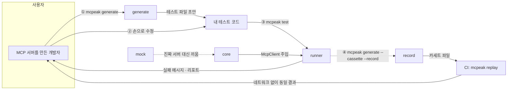

# 전체 구조와 병렬 작업 방식

> 이 문서는 "패키지가 순서대로 쌓이는 단계인가, 동시에 갈 수 있는가"에 답한다.
> 결론부터: **동시에 간다.** 아래에 근거와 오늘 당장 시작하는 법을 적는다.

## 1. 사용자가 겪는 흐름



한 줄로: **generate가 초안을 뽑고 → core가 서버에 붙고 → runner가 검증하고 → record가 그걸 재현 가능하게 만들고 → mock이 서버 없이도 돌게 한다.**

## 2. 패키지 경계 — 무엇을 받고 무엇을 내놓는가

| 패키지 | 입력 | 출력 | 핵심 책임 |
|---|---|---|---|
| `core` | `ConnectOptions` (command·args·env·cwd 또는 url·headers) | `McpClient` | 프로세스 기동·종료, 핸드셰이크, 타임아웃, stderr 수집 |
| `runner` | `McpClient` (**주입받음**) | 실패 메시지 · 리포트 · JUnit XML | 공개 API, matcher, **실패 메시지 품질** |
| `generate` | `ToolDef[]` (**주입받음**) | 테스트 소스 파일 경로 · 승인된 suite snapshot | 결정론적 baseline 합성, AI authoring 검토·승인 |
| `record` | `McpClient` (**감쌈**) | 카세트 파일 | 녹화·재생, 매칭 키, 비밀값 마스킹 |
| `mock` | 툴 정의 · 주입할 응답 | 목 서버 | 응답 주입 (사람이 지정한 값, ADR-0005), 입력 스키마 검사 |
| `cli` | `argv` | 종료 코드 | 얇은 디스패처. 각자 자기 서브커맨드만 |

의존 방향은 단방향이다. 역참조·순환 금지.

```
cli → generate → runner → core
cli → runner → core
cli → record / mock → core
```

### `generate → runner`의 현재 상태

위 그림의 `generate → runner`는 타입 참조만이 아니다. `generate`는 `runner`에서 **런타임 값**도
가져온다. 현재 참조는 셋이다.

| 가져오는 것 | 종류 | 쓰이는 곳 |
|---|---|---|
| `TestSuiteSpec`, `TestCaseSpec`, `SuiteValidationIssue`, `RunnerRedactionOptions` | 타입 | suite 합성과 authoring 전 구간 |
| `validateMcpSuite` | 함수 | provider 결과와 로컬 candidate를 suite 계약으로 재검증 |
| `MCP_SUITE_JSON_SCHEMA` | 상수 | provider 프롬프트에 suite 형식을 알림 |
| `DEFAULT_SENSITIVE_KEYS`, `REDACTED` | 상수 | authoring suite redaction |

이것은 선언된 단방향 규칙(`cli → generate → runner → core`)에 어긋나지 않는다. `generate`가
`runner`를 참조하는 것은 화살표 방향 그대로다. 다만 아래 §3의 "core의 **타입**만 있으면 되고
**구현**은 필요 없다"는 서술은 core에 대한 것이고, `runner`에 대해서는 성립하지 않는다.
`generate`는 `runner`의 구현(검증 함수와 스키마 상수)에 의존한다.

이 의존을 없애려면 suite 스펙과 검증기를 두 패키지가 공유하는 더 낮은 층으로 내려야 한다.
그것은 패키지 경계를 바꾸는 결정이라 별도 ADR 대상이며 **아직 정해지지 않았다.** 여기서는
현재 상태만 적는다.

## 3. 왜 단계가 아니라 병렬인가

**`connect()`를 호출하는 패키지가 하나도 없다.** 네 패키지 모두 core의 산출물을 *인자로 받는다*:

```ts
createMcpTest({ client: McpClient }, body)   // runner   — client 를 받는다
generateTests(tools: ToolDef[], opts)        // generate — tools 를 받는다
cassetteClient(inner: McpClient, opts)       // record   — client 를 받는다
createMockServer({ tools: ToolDef[] })       // mock     — tools 를 받는다
connect(opts): Promise<McpClient>            // core     — 값을 만드는 유일한 함수
```

즉 core의 **타입**만 있으면 되고, **구현**은 필요 없다. 그리고 타입은 이미 동결돼 있다 (`packages/core/src/types.ts`, CONTRIBUTING §3).

이걸 뒷받침하는 설정이 두 개 더 있다:

- `tsconfig.base.json`의 paths가 `dist`가 아니라 **소스**를 가리킨다 → core를 빌드하지 않아도 타입이 잡힌다.
- `turbo.json`의 `typecheck.dependsOn: []` → 순서 제약이 없다. 6개가 동시에 돈다.

**실측:** `packages/core/dist`를 통째로 지운 상태에서 `runner`의 typecheck · build · test가 전부 통과한다.

## 4. 그래서 오늘 어떻게 시작하나

core를 기다리지 않는다. `McpClient`는 메서드 세 개짜리 인터페이스라 직접 만들면 된다.

```ts
import type { McpClient, ToolDef } from "@mcpeak/core";

const fixture: ToolDef[] = [
  { name: "get_weather", description: "날씨 조회", inputSchema: {} },
];

const client: McpClient = {
  listTools: async () => fixture,
  callTool: async (name, args) => ({ content: {...}, isError: false, raw: {...} }),
  close: async () => {},
};
```

재료는 `fixtures/tools-list.sample.json`에 이미 있다. W1 검증 항목이 "각 패키지가 **픽스처 기준** 테스트 통과"인 이유가 이것이다.

core가 완성되면 바뀌는 건 한 줄이다.

```diff
- const client: McpClient = { ... };
+ const client = await connect({ command: "node", args: ["./server.js"] });
```

## 5. 정직하게, 병렬이 안 되는 것

| 항목 | 왜 |
|---|---|
| 실제 서버 E2E | 가짜 client는 "내가 상상한 응답"만 준다. 진짜 에러 포맷·타임아웃·stderr는 `connect()` 이후에만 보인다 |
| `cli`의 `test` 서브커맨드 | 실제로 서버를 띄워야 한다 |
| `build` 순서 | `turbo.json`의 `build.dependsOn: ["^build"]` — CI 시간 문제지 개발 블로킹은 아니다 |
| `types.ts` 변경 | 여기가 바뀌면 전원이 멈춘다. 그래서 동결이고, 변경엔 PR + 영향 오너 전원 승인이 필요하다 |

통합은 화·금 주 2회 고정(§9). 그때 붙여 보고 깨진 지점을 이슈로 만든다.

## 6. 기여량이 패키지마다 다른 문제

부하는 실제로 다르다.

| | 초반 | 후반 | 비고 |
|---|---|---|---|
| `core` | **최대** | 낮음 | W1에 동결 못 하면 전원 대기 |
| `runner` | 중 | **높음** | 실패 메시지 다듬기가 끝까지 간다 |
| `record` | 중 | 중 | 설계 판단이 앞에 몰려 있다 |
| `generate` | 낮음 | 중 | 범위만 정하면 기계적 |
| `mock` | 중 | **최대** | npm 배포·버저닝·도그푸딩 겸임 |

다만 개인 기여의 증거는 PR 개수가 아니다 (§1-3). 릴리스 노트 · ADR · PR 리뷰 셋이고, **§12의 체크리스트는 패키지 크기와 무관하게 전원 동일하다**:

- 내가 오너인 패키지가 있고, 그 패키지의 커밋 대부분이 내 것이다
- 내 이름으로 된 CHANGELOG 항목이 3건 이상
- 내가 쓴 ADR이 2건 이상
- 다른 사람 PR에 남긴 리뷰 코멘트가 10건 이상
- 내가 해결한 "어려웠던 문제"를 3분 안에 설명할 수 있고, 근거가 이슈나 ADR에 남아 있다

큰 패키지를 맡았다고 이 기준이 올라가지 않고, 작은 패키지를 맡았다고 내려가지도 않는다. 리뷰 10건은 **남의 PR에** 남기는 것이라, 오히려 자기 패키지가 가벼운 사람이 채우기 쉽다.

ADR도 이미 1인 1개씩 균등 배정돼 있다:

| ADR | 주제 | 작성자 |
|---|---|---|
| 0001 | 트랜스포트 전략 — stdio vs 인프로세스 | `core` 오너 |
| 0002 | matcher — 기존 러너 확장 vs 독립 구현 | `runner` 오너 |
| 0003 | 카세트 매칭 키와 비결정 필드 처리 | `record` 오너 |
| 0004 | 생성 테스트의 범위 | `generate` 오너 |
| 0005 | 목 데이터 — 사람이 작성 vs 스키마 기반 생성 | `mock` 오너 |

패키지 크기와 무관하게 "다르게 갈 수도 있었던 판단"을 1인당 하나씩 남긴다. (§12는 1인 2건 이상을 요구하므로, 스켈레톤 5개 외에 각자 하나씩은 더 쓰게 된다.)

> **[제안 — 미합의]** 실제로 조정이 필요해 보이는 건 하나다. `mock` 오너가 npm 배포·버저닝·도그푸딩까지 겸해 부담이 크다. 도그푸딩(외부 MCP 서버 3~5개에 우리 도구 적용, §10)을 5명이 하나씩 나눠 가지면 균형이 맞고 `docs/adoption.md` 실적도 각자 이름으로 쌓인다. 논의 대상이다.

## 7. CLI와 Core 연결 결정

2026-08-12 승인된 [Core stdio transport 설계](./superpowers/specs/2026-08-12-core-stdio-transport-design.md)에
따라 CLI가 composition root로서 Core와 Runner를 직접 조립한다.

```text
cli → core
cli → runner
runner → core의 동결 타입
```

Runner는 Core의 `connect` 또는 `connectStdio`를 재수출하지 않는다. Core도 Runner를 import하지
않는다. `mcpeak test`를 구현하면서 `cli` 가 `@mcpeak/core` workspace dependency를 팀 승인
범위로 받았고, 지금은 `packages/cli/package.json` 에 선언돼 있다.
