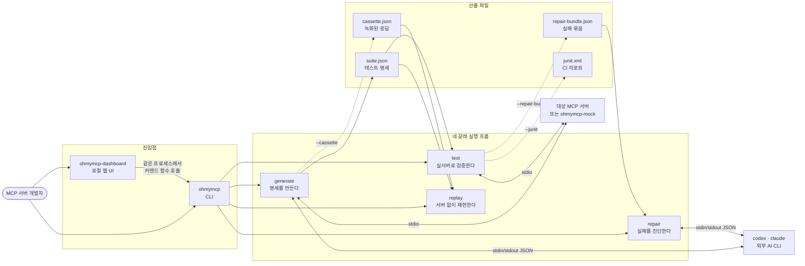
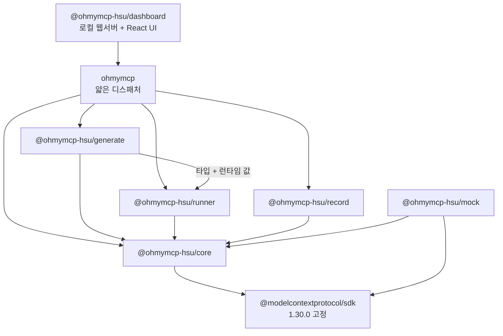
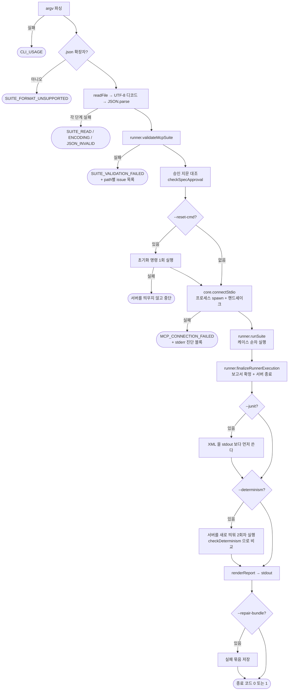
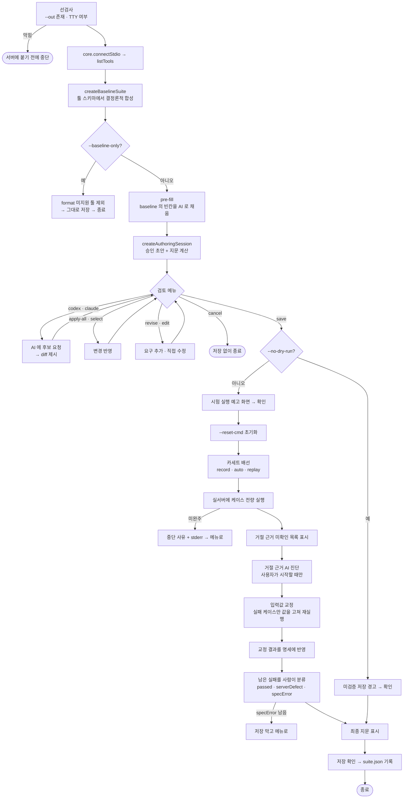
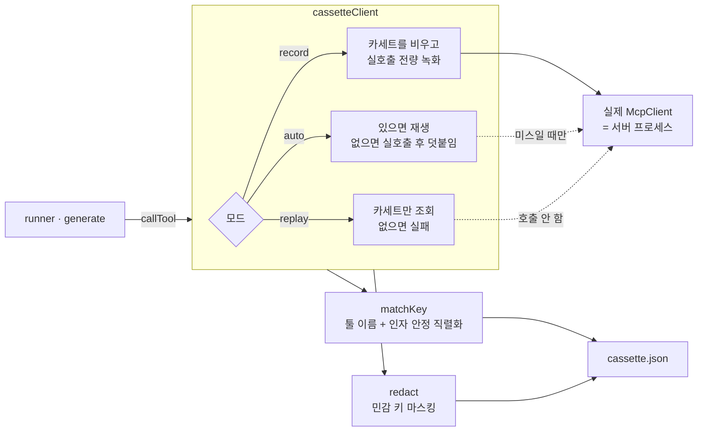
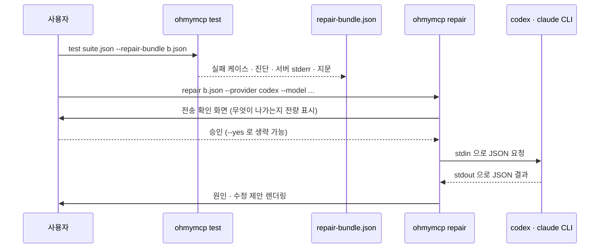
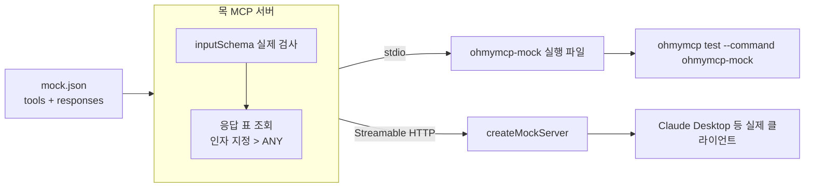
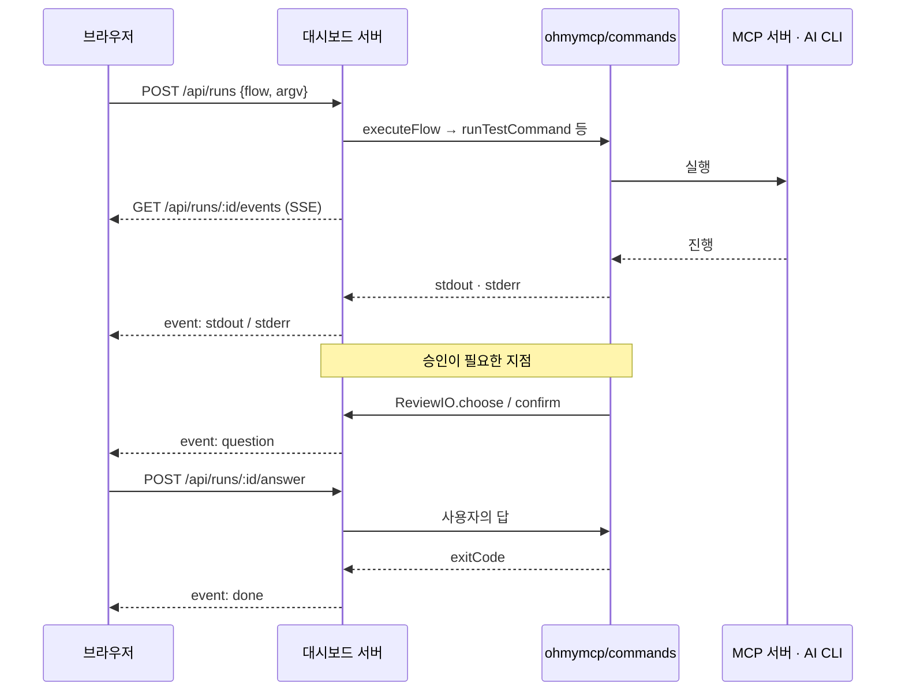
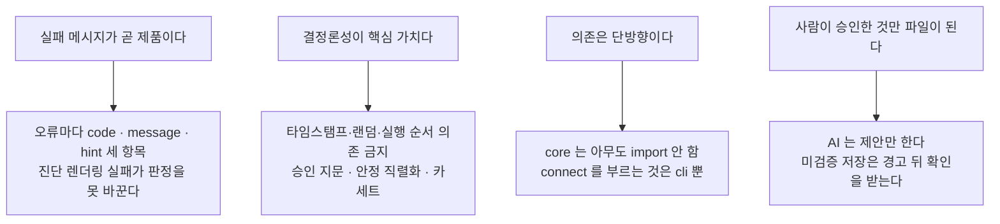

# OhMyMCP 설계 흐름도

> 이 문서는 **지금 소스에 있는 것**만 그린다. 근거는 각 절 끝의 파일 경로다.
> 패키지 경계와 병렬 작업 근거는 [`architecture.md`](./architecture.md), 개별 판단은 [`adr/`](./adr) 에 있다.

---

## 0. 한 문장

**generate 가 명세 초안을 뽑고 → core 가 서버에 붙고 → runner 가 검증하고 → record 가 그걸 서버 없이 재현하게 만들고 → mock 이 서버 자체를 대체하고 → repair 가 실패의 원인을 되묻는다.**

---

## 1. 시스템 전경

점선은 **옵션을 줬을 때만** 생기는 경로다.

---

## 2. 패키지 의존 그래프

읽는 법 세 가지.

- **화살표는 한 방향뿐이다.** 역참조·순환이 없다. `core` 는 누구도 import 하지 않는다.
- **`core` 를 부르는 것은 `cli` 뿐이다.** `runner`·`generate`·`record` 는 `connect()` 를 호출하지 않고 `McpClient` 를 **주입받는다**. 그래서 6개 패키지가 서로를 기다리지 않고 병렬로 개발됐다.
- **`generate → runner` 는 타입만이 아니다.** `validateMcpSuite`, `checkInputContract`, `MCP_SUITE_JSON_SCHEMA`, `deriveContractAxes` 같은 **런타임 값**을 가져온다. 화살표 방향은 맞지만 "타입만 있으면 된다" 는 서술은 `core` 에만 해당한다 (ADR-0009).

`dashboard` 는 README 의 6패키지 표에 아직 없다. `ohmymcp/commands` 재export 면을 통해 CLI 위에 얹힌 **7번째 패키지**다 (ADR-0046).

> 출처: 각 `packages/*/package.json`, `packages/cli/src/index.ts`, `packages/dashboard/src/server/wiring.ts`

---

## 3. `ohmymcp test` — 검증 흐름

가장 많이 쓰이는 경로. **판정에 영향이 없는 것부터 순서대로 끊는다.**

이 그림에서 **설계 판단이 들어간 곳**은 네 군데다.

| 지점 | 왜 그 자리인가 |
|---|---|
| 지문 대조가 연결 **앞** | 연결이 실패해도 파일에 대한 사실은 변하지 않는다 |
| `--reset-cmd` 가 연결 **앞** | 되돌리지 못한 상태 위에서 돌린 결과는 판정 근거가 될 수 없다 (ADR-0023) |
| JUnit 쓰기가 stdout **앞** | `\| head` 로 stdout 이 EPIPE 로 깨져도 명시적으로 요청한 산출물은 남아야 한다 (ADR-0019) |
| 2회차 실패가 **판정을 안 바꿈** | 1회차 종료 코드는 이미 정해졌다. 관찰 실패로 시험 판정을 뒤집지 않는다 |

`--determinism` 은 서버 프로세스를 **새로 띄운다.** 1회차 연결은 종료 절차로 이미 닫혔고 프로세스 내부 상태도 초기화 대상이라 재사용하지 않는다.

> 출처: `packages/cli/src/test-command.ts` (`runCli`), `packages/runner/src/executor.ts`, `packages/runner/src/determinism.ts`

---

## 4. `ohmymcp generate` — 명세 생성 흐름

가장 복잡한 경로다. **결정론적 층 → AI 층 → 실서버 층 → 사람 승인 층** 네 겹으로 쌓여 있고, 각 층은 아래층을 못 건너뛴다.

핵심 규칙 다섯.

1. **AI 는 제안만 한다.** 승인 없이 파일에 닿는 경로가 없다. `--baseline-only` 는 AI 를 아예 안 부른다 (ADR-0006).
2. **거절 근거 AI 진단은 자동으로 안 돈다.** 케이스가 많으면 비용이 곱해지고 provider 없는 사용자가 대다수다. 결과는 화면에만 나가고 이후 교정·분류·저장은 그 값을 읽지 않는다.
3. **입력값 교정은 케이스 하나짜리 스위트로 재실행한다.** 전량을 다시 돌리면 앞서 통과한 케이스가 상태 변화로 뒤집힌다.
4. **지문은 교정이 끝난 뒤 읽는다.** 화면에 찍은 값과 저장되는 `approval.fingerprint` 는 언제나 같아야 한다 (ADR-0026).
5. **`specError` 가 하나라도 남으면 저장이 막힌다.** 명세가 틀린 채로 승인 기록이 남으면 안 되기 때문이다.

> 출처: `packages/cli/src/generate-command.ts` (`runGenerateCommand`, `runInteractiveReview`), `packages/generate/src/baseline.ts`, `packages/generate/src/authoring-session.ts`

---

## 5. 카세트 — 녹화 · 재생

`record` 는 `McpClient` 를 **감싸는 데코레이터**다. 감싸인 쪽은 자기가 녹화당하는 줄 모른다.

- **매칭 키는 툴 이름 + 인자의 안정 직렬화다.** 키 순서·부동소수 표기가 달라도 같은 호출로 본다 (ADR-0003, ADR-0029).
- **마스킹은 스키마와 데이터에 다른 규칙으로 건다** (ADR-0040, ADR-0041). 민감 키 목록의 복수형·합성어 처리 경계는 ADR-0039·0045 에 있다.
- **`replay` 서브커맨드에는 `connect` 자체가 없다.** 서버를 안 띄운다는 사실이 주석이 아니라 `ReplayCommandDependencies` 타입에 드러난다 (ADR-0028).

> 출처: `packages/record/src/index.ts` (`cassetteClient`, `matchKey`, `redact`), `packages/cli/src/replay-command.ts`, `packages/cli/src/cassette-wiring.ts`

---

## 6. `ohmymcp repair` — 실패 진단

`test` 와 `repair` 를 **파일 하나로 끊어 놓은** 것이 이 흐름의 설계다. 진단이 필요한 사람만 AI 를 부른다.

- **번들에는 형식 버전이 있다.** 낡은 번들이 조용히 반쪽으로 도는 대신 "최신 test 로 다시 만드세요" 라고 말한다.
- **서버 stderr 는 `--no-stderr` 로 뺄 수 있다.** stderr 는 서버가 자유롭게 쓰는 텍스트라 경로·토큰이 섞일 수 있다 (ADR-0033).
- **`generate` 는 정적 import 하지 않고 주입받는다.** 정적으로 묶으면 `test` 경로까지 `generate` 를 함께 로드하게 된다.
- **AI 자식 프로세스의 환경변수는 허용 목록으로 자른다.** codex 자식이 Anthropic 자격증명을, claude 자식이 OpenAI 자격증명을 받지 않는다.

> 출처: `packages/cli/src/repair-bundle.ts`, `packages/cli/src/repair-command.ts`, `packages/generate/src/providers.ts`, `packages/generate/src/provider-process.ts`

---

## 7. mock — 서버 자체를 대체한다

- **응답은 사람이 지정한 값이다.** 스키마에서 랜덤 생성하지 않는다. 같은 호출은 언제나 같은 바이트를 돌려준다 (ADR-0005).
- **목이 `inputSchema` 를 실제로 검사한다** (ADR-0048). 안 그러면 목에서만 통과하는 테스트가 생긴다.
- **실패 응답도 계약의 절반이다.** `isError` 로 "이렇게 거절한다" 를 설계 단계에서 선언할 수 있다. 매칭 미스가 만드는 `isError` 와는 본문으로 구분된다.
- 그래서 mock 은 **서버를 만들기 전에 설계를 먼저 검증하는** 용도로도 쓴다 — 목을 띄워 실제 클라이언트에 붙여 보고, 거기서 `generate` 로 구현자에게 넘길 계약 초안을 뽑는다.

> 출처: `packages/mock/src/index.ts`, `packages/mock/src/input-validation.ts`

---

## 8. 대시보드 — 같은 흐름의 웹 얼굴

대시보드는 CLI 를 **다시 구현하지 않는다.** 같은 커맨드 함수를 같은 프로세스에서 부르고, 터미널 입출력 자리에 HTTP 를 끼운다.

- **터미널의 `ReviewIO` 자리에 브라우저를 끼운 것**이 전부다. `generate` 의 대화형 승인이 웹에서 그대로 돈다.
- SSE 이벤트 id 는 run 안에서 1부터 단조 증가한다 — 재연결 커서다.
- CLI 흐름이 순차적이라 **동시에 pending 인 질문은 최대 1개**다.
- 파일 API 는 `suites` · `cassettes` 두 종류를 읽고 쓴다. 저장 충돌은 `mtimeMs` 왕복으로 잡는다.

> 출처: `packages/dashboard/src/api-types.ts`, `packages/dashboard/src/server/routes.ts`, `packages/dashboard/src/server/wiring.ts`, `packages/dashboard/src/server/review-bridge.ts`

---

## 9. 파일 계약

흐름 사이를 잇는 것은 함수 호출이 아니라 **파일**이다. 그래서 각 흐름을 따로 돌릴 수 있다.

| 파일 | 만드는 것 | 읽는 것 | 안에 무엇이 있나 |
|---|---|---|---|
| `suite.json` | `generate` | `test` · `replay` | `schemaVersion` · `cases[]` · `approval.fingerprint` · `approval.cases[]` |
| `cassette.json` | `generate --cassette` | `replay` | `tools` 스냅샷 · 매칭 키별 상호작용 · 마스킹된 값 |
| `repair-bundle.json` | `test --repair-bundle` | `repair` | `bundleVersion` · 실패 케이스 · 진단 · 서버 stderr · 지문 |
| `junit.xml` | `test --junit` | CI | 케이스별 결과. `time` 속성은 고정값 (ADR-0016) |

**승인 지문(`approval.fingerprint`)이 이 계약의 중심이다.** 명세의 sha256 이고, `approval` 블록 자신은 계산에서 빠진다. 파일이 승인 이후 바뀌었는지를 이 한 값으로 안다.

---

## 10. 전체를 관통하는 규칙

이 설계가 왜 이렇게 생겼는지는 규칙 네 개로 설명된다.

**`core/src/types.ts` 의 `McpClient` · `ToolResult` 가 이 그림 전체의 고정점이다.** 메서드 세 개짜리 인터페이스 하나가 6개 패키지의 병렬 작업과 테스트 더블 전량을 지탱한다. 여기가 바뀌면 전원이 깨진다.

---

## 부록. 이 문서와 다른 문서가 어긋나는 지점

읽는 사람이 헷갈릴 만한 곳을 적어 둔다.

- **`architecture.md` 는 6패키지 기준이다.** `dashboard` 와 `test` 의 `--determinism` · `--repair-bundle`, `replay` · `repair` 서브커맨드가 그 문서에는 없다.
- **README 의 CLI 사용법이 `help.ts` 보다 짧다.** 실제 지원 옵션은 `ohmymcp --help` 가 기준이다.
- **`record` · `mock` 은 서브커맨드로 구현돼 있지 않다.** `COMMANDS` 배열에는 있지만 `COMMAND_NOT_IMPLEMENTED` 를 낸다. 목은 `ohmymcp-mock` 이라는 자기 실행 파일로 쓰고, 녹화는 `test` · `generate` 의 `--cassette` 로 한다.
